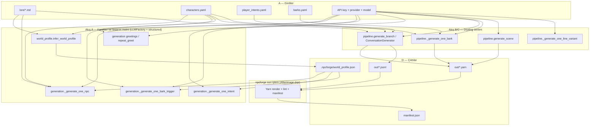
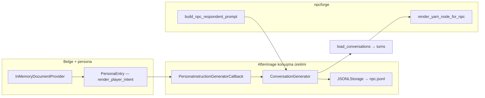

# Karakter ve diyalog üretiminde Afterimage — diyagram kaynağı

Bu belge **yalnızca karakter + diyalog (ve bunlara bağlı yardımcı üretim)** akışlarını anlatır: hangi **girdi** dosyaları, npcforge’da hangi **modül/fonksiyon**, afterimage’da hangi **API**, hangi **çıktı**. Harici görsel/diyagram çizerken düğüm ve okları buradan türetebilirsin.

---

## 1. Diyagram için önerilen katmanlar (renk / swimlane)

| Katman | İçerik | Diyagramda |
|--------|--------|------------|
| **A — Girdi** | `lore/*.md`, `characters.yaml`, `player_intents.yaml`, `barks.yaml`, `layers.yaml` (opsiyonel), API anahtarı, provider/model | Sol veya üst “Dosya / config” |
| **B — npcforge (prompt & şema)** | `prompts.py`, `schemas.py` (Pydantic), `world_profile.py`, `generation.py`, `pipeline.py` içi string şablonlar | Orta “Oyun mantığı” |
| **C — Afterimage** | `LLMFactory`, `ConversationGenerator`, belge/persona/storage, embedding fabrikası | Ayrı swimlane veya belirgin kutu |
| **D — Çıktı** | `.npcforge/world_profile.json`, güncellenmiş YAML, `out/*.yarn`, `out/*.jsonl`, `manifest.json` | Sağ veya alt “Artefakt” |

**npcforge-only (Afterimage dışı)** ama üretim hattında bitişik: Yarn **render** (`yarn.py`), **lint** (`lint.py`), **manifest** (`manifest.py`), CSV satır bankası (`audio.py` / line export). Diyagramda kesik çizgi veya gri kutu ile ayırabilirsin.

---

## 2. Ortak Afterimage yapı taşları

| Bileşen | Rol |
|---------|-----|
| `afterimage.providers.LLMFactory` | `create(provider, model_name, api_key, system_instruction)` → async client. |
| `llm.agenerate_structured(prompt, schema=PydanticModel, temperature=…)` | Tek istekte şemaya uygun JSON nesnesi (karakter, intent, bark satırı, sahne, …). |
| `afterimage.common.default_model_name` | `model_name=None` iken yedek model adı. |
| `afterimage.ConversationGenerator` | Çok turlu walk-up diyalog üretimi. |
| `afterimage.InMemoryDocumentProvider` + `afterimage.types.PersonaEntry` | Tek “belge” = dünya + NPC sayfası; tek persona = o turdaki oyuncu **intent** metni. |
| `afterimage.PersonaInstructionGeneratorCallback` | Correspondent tarafı talimat üretimi (API + model + belgeler). |
| `afterimage.storage.JSONLStorage` | Üretilen konuşmaları `out/<npc_id>.jsonl` yoluna yazar. |
| `afterimage.evaluator.default_embedding_provider_config` | Chat provider’a göre embedding backend seçimi. |
| `afterimage.key_management.SmartKeyPool` | Tek anahtarlı havuz. |
| `afterimage.providers.embedding_providers.EmbeddingProviderFactory` | Embed istemcisi; `embed(texts)` → vektör listesi. |

---

## 3. Akış A — Karakter ve “tasarım” metni (structured LLM)

Hepsi **`generation.py`** ve **`world_profile.py`** üzerinden: **`LLMFactory.create` → `agenerate_structured`**.

| Adım | Kaynak kod | Girdi | Afterimage çıkış şeması | Çıktı artefakt |
|------|------------|-------|-------------------------|----------------|
| A1 — Dünya özeti | `world_profile.py` → `infer_world_profile` | `lore/*.md` birleşik metin | `WorldProfile` | `.npcforge/world_profile.json` |
| A2 — NPC sayfası | `generation.py` → `_generate_one_npc` | Lore + `WorldProfile` + mevcut cast özeti + brief + `layers` bloğu | `_NpcSheetLite` → `NpcSheet` | `characters.yaml` (ekleme) |
| A3 — Oyuncu intent | `generation.py` → `_generate_one_intent` | `WorldProfile` + mevcut intent id listesi + brief | `PlayerIntent` | `player_intents.yaml` |
| A4 — Bark tetikleyici | `generation.py` → `_generate_one_bark_trigger` | `WorldProfile` + `render_character_sheet(npc)` + brief | `BarkTrigger` | `barks.yaml` (iç içe) |
| A5 — Zaman selamı | `generation.py` → `_generate_one_greeting` / `gen_time_of_day_greetings` | NPC + `ProjectVariable` + profil blokları | `_GreetingLine` | `out/<npc>_greet_<var>.yarn` |
| A6 — Tekrar ziyaret selamı | `generation.py` → `_generate_one_repeat_greeting` / `gen_repeat_greeting_node` | NPC + ziyaret indeksi + profil | `_GreetingLine` | `out/<npc>_repeat_greet.yarn` |

**Diyagram ipucu:** A1 genelde **önce** çalışır ve downstream promptlara `format_profile_for_prompt` ile girer; A2–A6 paralel veya sıralı batch’lenebilir — diyagramda A1’ten A2’ye tek yön ok yeterli.

---

## 4. Akış B — Walk-up diyalog (Yarn dalları, çok turlu)

**Dosya:** `pipeline.py`.

### B1 — İş paketi başına (her NPC × her çözümlen intent)

| Alt adım | Fonksiyon / nesne | Açıklama |
|----------|-------------------|----------|
| B1a | `_build_provider` | `InMemoryDocumentProvider`: tek doküman = `world_bible` + `render_character_sheet(npc, cast, layers)`; `doc.personas = [PersonaEntry(descriptions=[render_player_intent(intent)])]`. |
| B1b | `PersonaInstructionGeneratorCallback` | `api_key`, `documents=provider`, `model_name`, `model_provider_name`, `num_random_contexts=1`, `n_instructions=1`. |
| B1c | `JSONLStorage(conversations_path=out/<npc_id>.jsonl)` | Ham konuşma satırları. |
| B1d | `ConversationGenerator` | `respondent_prompt=build_npc_respondent_prompt(npc)`, `instruction_generator_callback`, `storage`, API/model. |
| B1e | `await generator.generate(num_dialogs=1, max_turns=…, max_concurrency=1)` | Asıl üretim. |
| B1f | `generator.load_conversations()` | Intent ile eşleşen konuşmayı seç → `turns: [{role, content}, …]`. |
| B1g | npcforge | `render_yarn_node_for_npc(npc, branches)` → **`out/<npc_id>.yarn`**; isteğe bağlı `score_voice_consistency` (bkz. akış D). |

**Paralellik:** `generate_for_npc` içinde intent başına `asyncio.Semaphore` ile sınırlı paralel `generate_branch`.

**Diyagram ipucu:** Bir **“Walk-up branch”** alt grafi çiz; sola `world + sheet + intent`, ortaya `Provider + PersonaInstructionGeneratorCallback + ConversationGenerator + JSONLStorage`, sağa `turns` → `Yarn`.

---

## 5. Akış C — Bark, sahne, line bank (structured LLM, tek çağrı veya toplu)

**Dosya:** `pipeline.py` (ve sahne için `scenes.py` prompt inşası).

| Adım | Fonksiyon | Girdi özeti | Afterimage | Şema / çıktı |
|------|-----------|-------------|-------------|--------------|
| C1 — Bark satırı | `_generate_one_bark` → `generate_barks_for_npc_trigger` | NPC + `BarkTrigger` (`n` varyant); `build_bark_respondent_prompt` | `LLMFactory` × `n` (gather + semaphore) | `BarkLine` → `out/<npc>_bark_<trigger>.yarn` + `.json` |
| C2 — Çoklu NPC sahne | `generate_scene` | `Scene`, cast, `build_scene_system_prompt`, bellek/faction/layers | `LLMFactory.agenerate_structured` | `SceneDialogue` → `write_scene_yarn` → `out/scene_<id>.yarn` |
| C3 — Line bank satırı | `_generate_one_line_variant` | Slot + tag açıklaması; `build_line_slot_prompt` | `LLMFactory.agenerate_structured` | `_LineOutput` (`text`) → `LineVariant` |

---

## 6. Akış D — Diyalog kalitesi (embedding; LLM değil)

Walk-up sonrası isteğe bağlı **`run_all(..., score_voice=True)`**:

| Adım | Dosya | Afterimage |
|------|-------|------------|
| D1 | `voice_score.py` → `score_voice_consistency` | `default_embedding_provider_config(provider)` + `SmartKeyPool.from_single_key` + `EmbeddingProviderFactory.create` → `embed(all_texts)` |

**Girdi:** NPC `sample_lines` + dallardaki `assistant` cümleleri. **Çıktı:** `manifest` içinde intent başına skor (kosinüs benzerliği, npcforge tarafında hesaplanır).

---

## 7. Üst seviye “build” birleşimi (diyagramda tek kutu: `run_all`)

**`pipeline.py` → `run_all`** tipik olarak:

1. Seçili NPC’ler için **walk-up** (akış B) → `.yarn` + `.jsonl` + lint + line export kayıtları.  
2. İstenirse **bark** (akış C1) → bark `.yarn` / `.json`.  
3. İstenirse **voice score** (akış D) → manifest alanları.  
4. **`manifest.json`** + hash’ler (npcforge; afterimage dışı).

CLI tarafında bu genelde **`tools.build_pipeline`** / `npcforge build` ile tetiklenir; diyagramda “CLI” kutusu `run_all`’a tek ok yeterli.

---

## 8. Mermaid — üst seviye (kopyala-yapıştır taslak)

Aşağıdaki blok harici araçlarda (GitHub, Mermaid Live, Notion) görselleştirilebilir; kendi diyagramında düğüm adlarını aynı tutman tutarlılık sağlar.

*(İsteğe bağlı voice skoru: `WU` → `voice_score.score_voice_consistency` → `MF`; diyagramda `WU` ile `MF` arasına küçük bir “EmbeddingFactory” alt kutusu eklenebilir.)*

---

## 9. Mermaid — walk-up iç detay (zoom-in)

---

## 10. Bu belgeyi diyagrama çevirirken kontrol listesi

- [ ] **İki ayrı LLM yolu** olduğunu göster: (1) `agenerate_structured` tek atımlık, (2) `ConversationGenerator` çok turlu walk-up.  
- [ ] **Aynı API anahtarı** hem `PersonaInstructionGeneratorCallback` hem `ConversationGenerator` hem `LLMFactory` yollarına gider.  
- [ ] **Embedding** yalnızca ses skoru / eval’de; Yarn metnini doğrudan üretmez.  
- [ ] **Çıktı dosya uzantıları**: walk-up için hem `.yarn` hem `.jsonl` (ham iz).  
- [ ] Opsiyonel: `layers.yaml` / `layers` → `render_character_sheet` ve `run_all` filtreleri (scope).

---

## 11. Kapsam dışı (bu diyagramda isteğe bağlı)

- **`improv.py`** — oyun içi tek cevap; `LLMFactory` + `ImprovReply` (batch “karakter yazımı” değil, runtime).  
- **`unseen.py`** — slot somutlaştırma; yine `LLMFactory` + structured draft.  
- **`tape_game`** — önceden üretilmiş Yarn oynatır; afterimage yok.

Bu bölümleri ayrı “Runtime / improv” diyagramına taşıyabilirsin; karakter+diyalog **batch üretim** diyagramını sade tutar.
